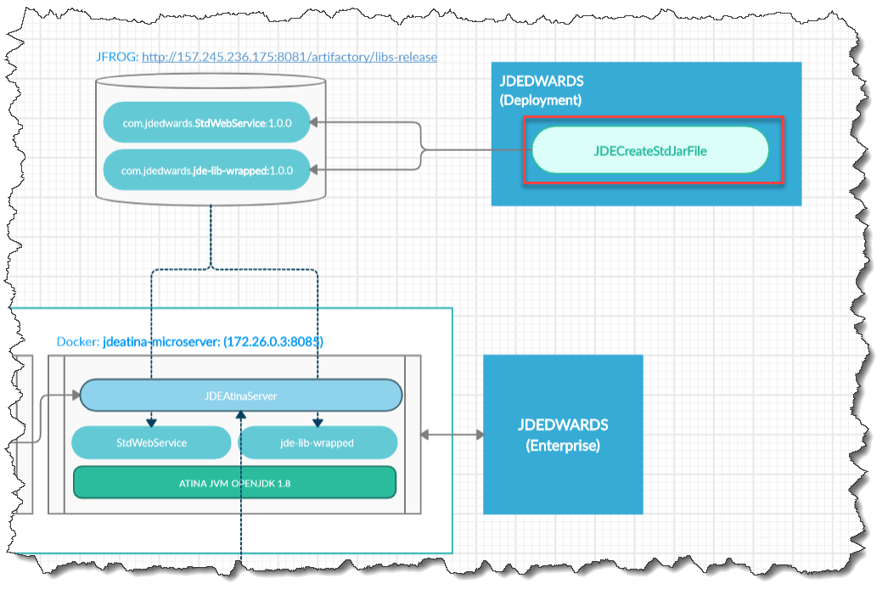

# JDE Create Std Jar File 

This tool is used by the customer to convert JDE Web Services and Required libraries as library for JDE Microserver.



## Preparing Build

Getting file from Deployment.

Create **/tmp/jde-lib-bundle** folder with the following structure:


```
jde-lib-bundle
      ├─ JDBC_Vendor_Drivers
      │  └─ sqljdbc42.jar    (Source: //Deplo/E920/MISC/sqljdbc42.jar)
      └─ system
         │─ Classes    (Source: //Deplo/E920/system/Classes\*) 
         │─ JAS  (Source: //Deplo/E920/system/JAS/webclient.ear/webclient.war/WEB-INF/lib/*)     
         └─ WS  (Source: //Deplo/E920\DV920/java/sbfjars/*)
 
```

## Build

**java** **-jar** target/JDECreateStdJarFile-1.0.0-SNAPSHOT.jar **-i** C:\_work\JDEConnectorCE\jdeJarsFile\jde-lib-bundle **-j** C:\_work\JDEConnectorCE\jdeJarsFile\jde-lib-bundle\JDBC_Vendor_Drivers **-r** "C:\Users\jgodi\.m2\repository" **-n** jde-lib-wrapped **-o** '1.0.0'


| Option | Description 
| -- | -- 
| -i | JDE jars libraries 
| -j | JDBC Drivers used 
| -r | Local Repository 
| -n | JDE Library Name
| -o | JDE Library Version

Destination:

...m2\repository\com\jdedwards\StdWebService\1.0.0\StdWebService-1.0.0-sources.jar

 
## 

Destination:

